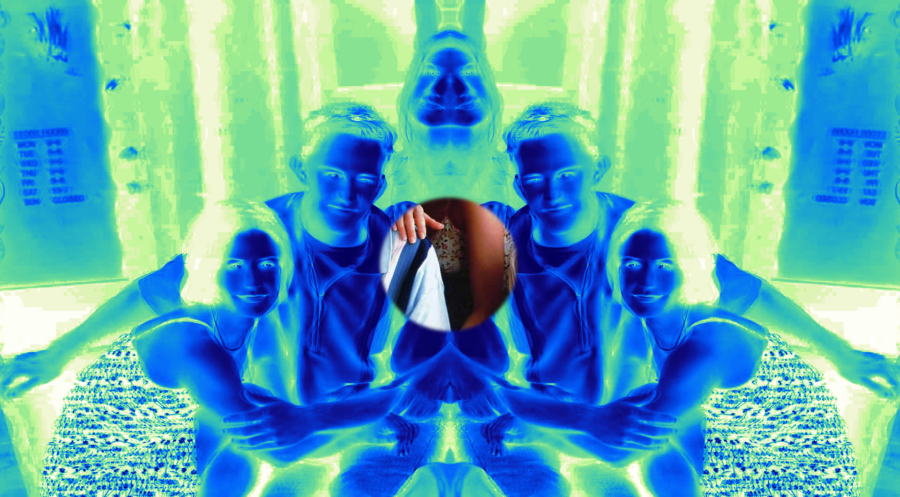
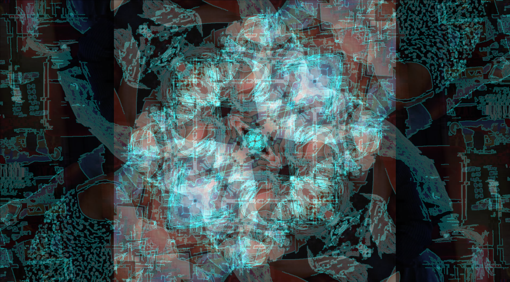
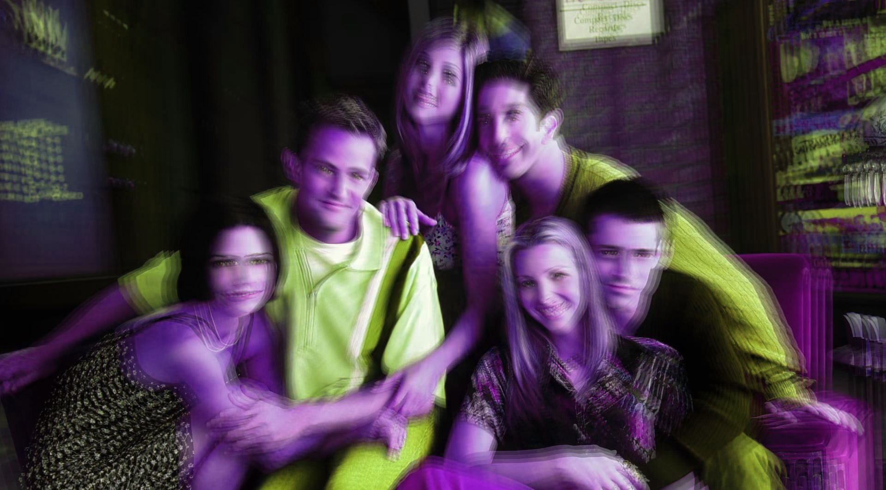
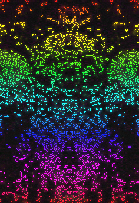
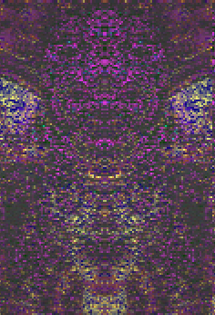

# Glitch Mirror

[](https://www.python.org/downloads/)
[](https://opensource.org/licenses/MIT)
[](https://opencv.org/)

A real-time video effects editor with face detection, custom masks, and data visualization overlays. Apply glitch effects, textures, and visual filters to webcam feeds, videos, or images.


### More Examples

|                                                     |                                                     |
|:---------------------------------------------------:|:---------------------------------------------------:|
|    |  |
|  |   |
|      |               |
## Features

### Real-Time Face Detection & Tracking
- Face detection using OpenCV Haar Cascades
- Persistent tracking IDs across frames
- Detects: faces, eyes, bodies, upper bodies, smiles, cat faces, license plates
- Per-face effect application with independent effect stacks

### 40+ Visual Effects
| Category | Effects |
|----------|---------|
| **Distortion** | Glitch, Wave Distort, Kaleidoscope, Mirror, Drunk, Spiral Warp |
| **Color** | Thermal, Color Shift, RGB Split, Chromatic Aberration, Duotone |
| **Artistic** | Cartoon, Sketch, Oil Paint, Emboss, Posterize |
| **Retro** | VHS, Film Grain, Scanlines, CRT |
| **Blur/Pixel** | Pixelate, Blur, Motion Blur, Radial Blur |
| **Glow** | Neon Glow, Edge Glow, Edge Highlight |
| **Special** | Negative, Halftone, Prism, Double Vision |

### Effect System
- **Effect Stacking**: Layer multiple effects on the same region
- **Baking**: Permanently apply effect stacks to detected faces
- **Video/Image Textures**: Overlay media onto faces with blend modes
- **Restore Original**: Cut through all effects to show clean image

### Custom Masks
- Create rectangle or ellipse mask regions
- Drag and resize masks in preview window
- Apply any effect within mask boundaries
- Invert masks to apply effects outside region

### Data Visualization
- Styled detection boxes (cyberpunk, matrix, HUD, thermal, neon)
- Connection lines between faces with custom colors
- Connection groups with different colors per group
- Labels, IDs, and coordinate overlays
- Animated pulse effects and scan lines

### Input/Output
- **Input**: Webcam, Video files (MP4, AVI, MOV, MKV), Images (JPG, PNG)
- **Output**: Video (MP4), Images, GIF export

---

## Installation

### Prerequisites
- Python 3.8 or higher
- ffmpeg (for video rendering)

### Quick Start

1. **Clone the repository**
   ```bash
   git clone https://github.com/Sad-Sun678/Glitch-Editor.git
   cd Glitch-Editor
   ```

2. **Install dependencies**
   ```bash
   pip install -r requirements.txt
   ```

3. **Install ffmpeg** (required for video export)
   - **Windows**: Download from [ffmpeg.org](https://ffmpeg.org/download.html) and add to PATH
   - **macOS**: `brew install ffmpeg`
   - **Linux**: `sudo apt install ffmpeg`

4. **Run the application**
   ```bash
   python main.py
   ```

---

## Usage

### Starting the Application
```bash
python main.py
```

On launch, you'll be prompted to select an input source:
- **Webcam**: Use your camera for live effects
- **Video File**: Load an MP4, AVI, or other video
- **Image**: Load a static image

### Keyboard Shortcuts

| Key | Action |
|-----|--------|
| `Q` | Quit application |
| `;` | Save current frame with effects |
| `Space` | Pause/resume video |
| `R` | Start/stop recording |

### Basic Workflow

1. **Detect Faces**: Click "Detect Now" or enable continuous detection
2. **Select Faces**: Choose faces from the detection list and click "Select"
3. **Apply Effects**: Choose an effect and click "Add to Stack"
4. **Bake or Render**: Either bake effects permanently or render to video

---

## Panel Guide

### Detection Tab
Configure face detection and manage tracked objects.
- Adjust detection sensitivity
- Keep/unkeep detections for stable tracking
- Single-shot mode for static images

### Effects Tab
Apply visual effects to selected faces.
- Effect dropdown with 40+ options
- Parameter sliders for customization
- Effect stacking system
- Video/image texture overlays

### Visualization Tab
Add data visualization overlays.
- Box styles and colors
- Connection lines between faces
- Color groups for connections
- Info panels and labels

### Tools Tab
Advanced tools and export options.
- Custom mask creation
- GIF export settings
- Preset management

---

## Building Standalone Executable

Create a distributable .exe file:

```bash
pip install pyinstaller
python build/build_exe.py
```

The executable will be in `dist/GlitchMirror/`.

**To distribute:**
1. Copy the entire `GlitchMirror` folder
2. Ensure ffmpeg is available on target machine
3. Run `GlitchMirror.exe`

---

## Project Structure

```
glitch-mirror/
├── main.py                     # Application entry point
├── src/                        # Source code
│   ├── core/                   # Core modules
│   │   ├── __init__.py
│   │   ├── effects.py          # 40+ visual effect implementations
│   │   ├── object_detection.py # Face detection, tracking & region effects
│   │   └── performance.py      # Frame skipping & performance monitoring
│   ├── ui/                     # User interface modules
│   │   ├── __init__.py
│   │   ├── detection_panel.py  # Main control panel (detection, effects, viz)
│   │   ├── effect_control_panel.py  # Global effect controls
│   │   ├── audio_effects_panel.py   # Audio processing panel
│   │   └── timeline_panel.py   # Timeline controls for video
│   └── utils/                  # Utilities
│       ├── __init__.py
│       └── panel_utils.py      # Shared UI utilities & preset paths
├── build/                      # Build & packaging
│   ├── build_exe.py            # PyInstaller build script
│   └── GlitchMirror.spec       # PyInstaller spec file
├── docs/                       # Documentation
│   └── CONTRIBUTING.md         # Contribution guidelines
├── presets/                    # Saved effect presets
├── screenshots/                # Documentation images
├── requirements.txt            # Python dependencies
├── LICENSE                     # MIT License
└── README.md                   # This file
```

---

## Tips & Tricks

### Better Performance
- Lower detection sensitivity for faster processing
- Disable unused detection types (eyes, bodies, etc.)
- Use single-shot mode for static images

### Stable Face Tracking
- Click "Keep" on faces before applying effects
- Kept faces maintain their IDs when moving
- Effects auto-keep faces when applied

### Best Results
- Ensure good, even lighting on faces
- Faces should be mostly frontal (not profile)
- For videos, start with faces visible in first frame

---

## Troubleshooting

| Problem | Solution |
|---------|----------|
| No faces detected | Improve lighting, face the camera directly |
| Effects not in render | Ensure effects are stacked/baked, face effects enabled |
| ffmpeg not found | Install ffmpeg and add to system PATH |
| Laggy performance | Lower detection sensitivity, disable unused features |
| Tracking IDs changing | Use "Keep" button on important detections |

---

## Contributing

Contributions are welcome! See [CONTRIBUTING.md](docs/CONTRIBUTING.md) for guidelines.

---

## License

This project is licensed under the MIT License - see the [LICENSE](LICENSE) file for details.

---

## Acknowledgments

- [OpenCV](https://opencv.org/) - Computer vision and face detection
- [NumPy](https://numpy.org/) - Array processing
- [Pygame](https://www.pygame.org/) - Audio processing
- [Pillow](https://pillow.readthedocs.io/) - Image handling

---

## Support

If you find this project useful, please consider giving it a star on GitHub!

For bugs and feature requests, please [open an issue](https://github.com/yourusername/glitch-mirror/issues).
